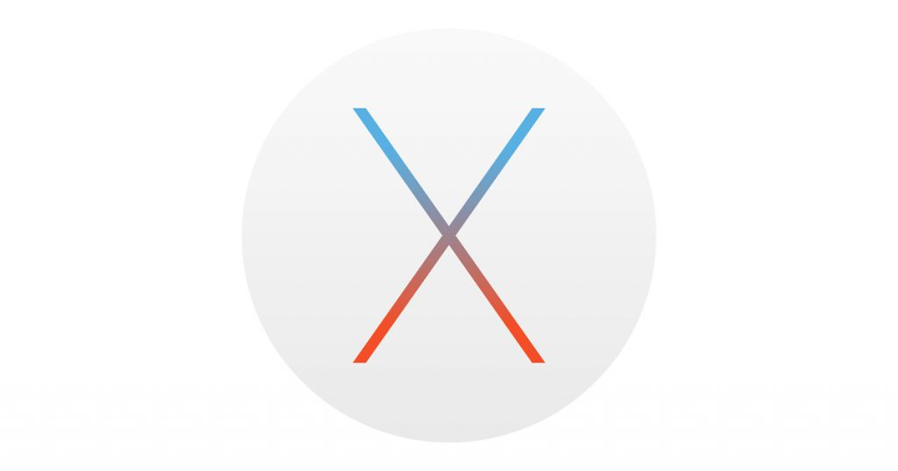

# macOS Applications

A Collection of macOS projects which are written in Swift Programming Language.

<h3 align="center">

</h3>

## Projects

* [Hello World](https://github.com/vinothvino42/macOS-App-Development/tree/master/Hello%20World)

## Compatibility

These projects are written in Swift 4 and requires Xcode 9.1 to build and run.

## Author

* [Vinoth Vino](https://twitter.com/vinothvino42)
